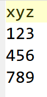
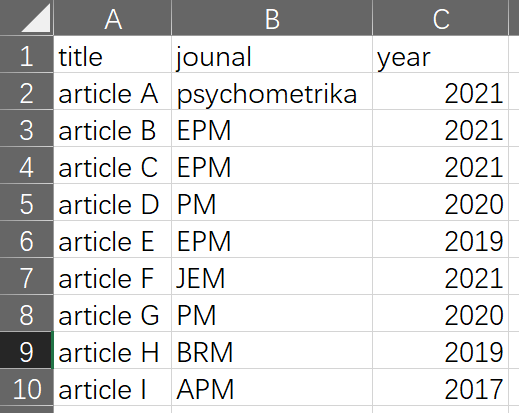
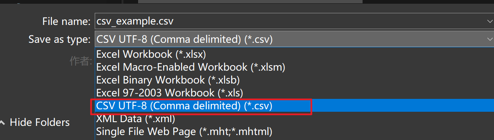
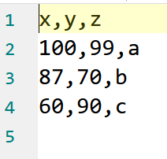
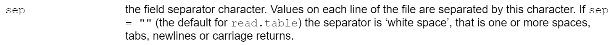

# Basic: read and write {#read-write}

进入互联网时代以后，数据的读取和写入就越来越频繁地进入到日常生活中。最常见的读取数据情境就是各种各样的“loading”——加载动画。加载动画实际上就是开发者为了解决读取数据需要时间，而这段时间内用户无法进行任何操作，只能干等的问题。加载动画一方面将读取数据的进度以进度条的方式告诉用户，让用户可以大致预期剩余的等待时间，另一方面也不至于太无聊。

虽然 R 的使用场景更多是与数据统计分析打交道，可能不会用到加载动画，但是数据读取是绝对高频的任务类型。可以说数据的读取和写入在 R 中是一项必不可少的技能。

如果是使用现成的统计分析软件分析数据，在导入数据的时候会是如下所示（视频截取自[spss之问卷数据导入分析（基于问卷星）](https://www.bilibili.com/video/BV1aA411878J/?spm_id_from=333.999.0.0&vd_source=bf75bd9bbadc189fc19d85feaef9c82b)）：

<video src="images/import data using spss.mp4" width="100%" controls="controls"></video>

使用 R ，就是把上面鼠标点击各种菜单的操作改成写代码而已，每一个操作在使用 R 写代码时都有对应的概念，例如：

1. 工作路径；
2. 文件后缀名；
3. 文件路径；
4. 从第一行数据读取变量名，等等。


## working directory

工作路径（working directory， wd），是 R 中与本地数据的读取和写入操作紧密联系的概念。

Working directory 可以简单理解为 R 工作时默认使用的文件路径，使用`getwd()`可以查看。

```{r}
getwd()
```

根据日常使用计算机的经验可以知道，想要打开任何文件都需要知道这个文件存储在计算机中的具体位置，哪个盘、哪个文件夹下、叫什么名字，这就是**文件路径**。同样的，如果通过使用读取和写入 function 的方式“指挥” R 来完成相应操作时，也需要知道读取和写入的目标文件的文件路径。正是因为 R 有 Working directory 这一概念，使得读取和写入时所需的文件路径有两种写法，绝对路径和相对路径：
```{r eval = FALSE}
read.table(file = "F:/Nutstore backup/R/codes/RBA/data/m1.txt")  # absolute path
# equivalent to
read.table(file = "data/m1.txt")  # the missing part will be automatically supplied by R using working directory
read.table(file = "/data/m1.txt") # for 2nd order subfolder, start relative path with / won't work
```

### Setworking directory

 R 在每次打开时（打开 Rstudio 时，Rstudio 会自动打开 R ）都会设定一个 working directory，根据具体情况的不同，working directory 不一样：

1. Rstudio 默认 working directory。通过双击 Rstudio 的快捷方式打开 R 时，会自动将 Rstudio 的安装路径作为默认 working directory，

2. xxx.R。在没有打开 Rstudio 和 R 的情况下，通过双击 xxx.R 的方式打开 Rstudio 时，会将该脚本所在文件目录作为默认 working directory，例如在 D 盘的根目录下有一个 R 的脚本  Hello World.R，双击后会自动打开 Rstudio，此时的 Working directory 就是`D:/`


3. xxx.Rproj（推荐）。通过双击 xxx.Rproj 的方式打开 Rstudio，会默认将该 .Rproj 文件所在文件目录作为默认 working directory，xxx.Rproj 对应一个 project，例如在 D:/Hello World 文件夹下创建一个 project，Rstudio 就会自动创建一个 Hello World.Rproj，双击该文件会自动打开 Rstudio


在已经打开的 Rstudio 中，也可以通过`setwd()`改变当前的 working directory（不推荐）：
```{r eval = FALSE}
# wd_old <- getwd()
wd_new <- "D:/data"
setwd(wd_new)
read.table("test/what/m1.txt")
# getwd()
# setwd(wd_old)
# getwd()
```


### Recommended combo for collaboration: Working directory + relative path

可以看到，如果是使用相对路径， R 就一定会使用 working directory 来补全出一个完整的文件路径。这样可以方便写代码时偷懒。使用绝对路径的好处是只要给出准确的路径信息， R 就一定能找到对应的文件，但是缺点是代码在其他计算机上运行的时候就可能会报错。但如果使用相对路径，就可以实现在不同的计算机上运行同一个读取\\写入本地文件的代码时不会报错。

```{r eval = FALSE}
# Coder A
setwd("D:/R")
read.table(file = "data/m1.txt")  
# will work as long as the file is stored in the "data" folder 
#  in the working directory, no matter what the working directory is
```

```{r eval = FALSE}
# Coder B
setwd("F:/Rfiles/project202201")
read.table(file = "data/m1.txt")  
# will work as long as the file is stored in the "data" folder 
#  in the working directory, no matter what the working directory is
```


## Read and write regular data

在日常生活中处理的数据大多数都是以矩阵的形式呈现的，姑且称具有矩阵形式的数据为*常规数据*，代表性的 structure types 有 vector，matrix，data.frame；称非矩阵形式的数据为*非常规数据*，代表性的 structure types 有 list 和 array。本小节先学习常规数据的读取和写入。


### Read

读取常规数据的 function 遵循 3 条普遍规律：

1. 大多数都是`read.xxx()`或`read_xxx()`这种命名方式，其中`xxx`为所读取数据文件的扩展名。

在 win 10 中可以通过如下方式开启显示文件的扩展名选项，如下图所示：


主流数据文件类型及其对应扩展名如下：

|    文件类型            | 扩展名       |
|------------------------|--------------|
| 纯文本型数据文件       | .txt  .dat   |
| 逗号分隔值文件         | .csv         |
| Excel 工作表           | .xls  .xlsx  |

2. 大多数读取常规数据的 function 的使用格式都是`read.xxx(filepath, arg)`。其中`filepath`是文件路径，例如要读取的数据文件是"1.txt"，放在 D 盘根目录下的 data 文件夹，那么`filepath = "D:/data/1.txt`（ R 的文件路径中不同层级文件夹之间用的是“/"，而 Windows 10 中用的是“//”，注意区别）；`arg`是一些额外的 argument，可以视作是读取数据时增加的一些限制，以保证读进来的数据和预期是一样的。
3.  R 中绝大部分读取常规数据的 function 会将读取的数据自动转换成 data.frame。

下面将通过一些例子来分别演示如何使用 function 来读取不同文件类型，以及这些 function 是如何遵顼上述三条规律的。

- **.txt** 和 **.dat**

数据如下：



读取代码为：
```{r txt_dat}
data_txt <- read.table(file = "F:/Nutstore backup/R/codes/RBA/data/txt_example.txt")
data_txt
is.data.frame(data_txt)
data_dat <- read.table(file = "F:/Nutstore backup/R/codes/RBA/data/txt_example.dat")
data_dat
is.data.frame(data_dat)
```

- **.xls** 和 **.xlsx**

数据如下：



读取代码为：
```{r xls_xlsx}
library(openxlsx)
data_xlsx <- read.xlsx(xlsxFile = "F:/Nutstore backup/R/codes/RBA/data/xlsx_example.xlsx")
data_xlsx
is.data.frame(data_xlsx)
```

- **.csv**

.csv 是一种通用的纯文本文件格式，可以将 .xlsx 文件通过另存为的方式转存成 .csv 文件，如下图：



由于 .csv 是纯文本文档，所以读取和写入速度要比 .xlsx 文档更快，通常会将 .xlsx 文件通过另存为的方式转存成 .csv 文件再处理。下面是读取 .csv 文档示例，数据和上面 .xlsx 的例子是一样的，代码如下：

```{r csv}
data_csv <- read.csv(file  = "F:/Nutstore backup/R/codes/RBA/data/csv_example.csv")
data_csv
is.data.frame(data_csv)
```


### Read: extra arguments

上面是读取常规数据 function 的最基本用法。如果数据本身的情况比较复杂，就需要在读取的时候给 function 提供额外的 argument，来保证读取进来的数据符合预期，下面来看两个例子。

1. 有明确分隔符的纯文本数据文件

数据如下图所示，可以看出，每一行中每个值之间是通过`,`来分隔的，



```{r txt_complicated}
# 不加任何额外 argument
data_txt_com <- read.table(file = "F:/Nutstore backup/R/codes/RBA/data/txt_example_complicated.txt")
data_txt_com
# 增加一个额外 argument, header = TRUE，意即数据文件中第一行为变量名
data_txt_com <- read.table(file = "F:/Nutstore backup/R/codes/RBA/data/txt_example_complicated.txt", header = TRUE)
data_txt_com
# 在 header = TRUE 的基础上再增加一个额外argument, sep = ","，意即数据文件中每一行的元素是由“,”分隔
data_txt_com <- read.table(file = "F:/Nutstore backup/R/codes/RBA/data/txt_example_complicated.txt", 
                           header = TRUE, 
                           sep = ",")
data_txt_com
```

2. 固定长度的纯文本数据文件

从之前介绍读取 .txt 和 .dat 文件的 function 时使用的例子可以看出，`read.table()`不加任何 argument 时读取的结果和预期并不一样，比如把变量名读作了数据，又比如本该分开的三列数据都合在了一起，那么该怎么办？让我们顺着上一个例子的思路，试试给`read.table()`增加额外的 argument，
```{r txt_dat_fwf}
data_txt <- read.table(file = "F:/Nutstore backup/R/codes/RBA/data/txt_example.dat", 
                     header = TRUE, 
                     sep = "")
data_txt
```

还是不行，难道是`sep = ""`没有发挥作用么？去看看`read.table()`的帮助文档，如下图所示：



原来`sep = ""`发挥了作用，但是和我们想象的不一样。所以，可以判定`read.table()`这条路是走不通的。那该怎么办？我的尝试步骤如下：

1. 观察一下原始数据文件，里面每一列的宽度都是固定的，那么可不可以考虑按照宽度来读取数据？
2. 在`read.table()`的帮助文档里面搜素一下，有没有和宽度（width）相关的内容，只有一处，提到了`read.fwf()`，如下图所示：


3. 但我还是不死心，不想去学新的 function，就想用`read.table()`搞定，去网上搜一下试试看，关键词为“read.table width”打开一个 stackoverflow 上的回答：[Read fixed width text file](https://stackoverflow.com/questions/14383710/read-fixed-width-text-file)，大意是提问者想请高人帮忙写代码读取如下数据（截取前几行展示）：
```{r eval = FALSE}
 Weekly SST data starts week centered on 3Jan1990

                Nino1+2      Nino3        Nino34        Nino4
 Week          SST SSTA     SST SSTA     SST SSTA     SST SSTA
 03JAN1990     23.4-0.4     25.1-0.3     26.6-0.0     28.6 0.3
 10JAN1990     23.4-0.8     25.2-0.3     26.6 0.1     28.6 0.3
 17JAN1990     24.2-0.3     25.3-0.3     26.5-0.1     28.6 0.3
 24JAN1990     24.4-0.5     25.5-0.4     26.5-0.1     28.4 0.2
 31JAN1990     25.1-0.2     25.8-0.2     26.7 0.1     28.4 0.2
```

高赞回答如下：

```{r eval = FALSE}
x <- read.fwf(
  file=url("http://www.cpc.ncep.noaa.gov/data/indices/wksst8110.for"),
  skip=4,
  widths=c(10, 9, 4, 9, 4, 9, 4, 9, 4))
```

其中，`skip = 4`表示读取时跳过头 4 行，`widths = c(10, 9, 4, 9, 4, 9, 4, 9, 4)`表示一共有 9 列数据，数字对应当前列数据的宽度。把读取固定宽度的数据想象成切菜，宽度的计算就好理解了。

下面截取一行数据来讲解宽度的计算，如下图所示：


所以，搜索的结论是，必须彻底抛弃`read.table()`，转向`read.fwf()`。模仿高赞回答，尝试使用如下代码：

```{r txt_dat_fwf_solution}
data_txt <- read.fwf(file = "F:/Nutstore backup/R/codes/RBA/data/txt_example.dat", 
                     widths = c(1,1,1), 
                     skip = 1, 
                     col.names = c("x", "y", "z"))
data_txt
```


### Fun fact: read table is everywhere

`read.csv()`和`read.fwf()`最终都是调用`read.table()`，相当于`read.table()`加了个壳。


### Write

与读取 function 类似，绝大多数写入数据的 function 也遵循 2 条普遍规律：

1. 都以`write.xxx()`或`write_xxx()`的方式命名，其中`xxx`是文件扩展名；
2. 使用格式都是`write.xxx(data, filepath, arg)`，其中`data`是 R 中将要写入文件的`object`，`filepath`和`arg`与读取`function`中的理解一致。

- **.txt**

```{r saveas_txt}
m1 <- matrix(c(99, 98, 97, 96), 2, 2)
colnames(m1) <- c("Tom", "Jerry")
m1
write.table(m1, file = "F:/Nutstore backup/R/codes/RBA/data/m1.txt")
```

写入的文件内容如下图所示：


- **.xlsx**

```{r saveas_xlsx_1}
library(openxlsx)
m1 <- matrix(c(99, 98, 97, 96), 2, 2)
colnames(m1) <- c("Tom", "Jerry")
m1
write.xlsx(m1, file = "F:/Nutstore backup/R/codes/RBA/data/m1.xlsx")
```

写入的文件内容如下图所示：


结果有问题，去`write.xlsx()`的帮助文档找找线索，如下图所示，


原来`write.xlsx()`要求数据必须是`data.frame`，那把数据转换成`data.frame`再试试看，代码如下：

```{r saveas_xlsx_2}
library(openxlsx)
m1 <- matrix(c(99, 98, 97, 96), 2, 2)
colnames(m1) <- c("Tom", "Jerry")
write.xlsx(as.data.frame(m1), file = "F:/Nutstore backup/R/codes/RBA/data/m1.xlsx", 
           overwrite = TRUE)
#  由于上一个例子中已经在同样的位置保存了一个 m1.xlsx，
#   所以要提供一个额外的argument, overwrite = TRUE，
#   表示 write.xlsx() 在写入数据时如果已经存在同名文件可以覆盖。
```

写入的文件内容如下图所示：


实际使用的过程中，常常是面临一个数据读取或写入的任务，文件格式已知，该怎么办？**解决思路**：

1. **搜索**：以“R” + “read”或“write” + “文件格式”或“软件名”为关键词，搜索合适的 function，如“R read SPSS”或“R write SPSS”通常能够搜索到带例子的解答；
2. 通常第一步就能解决问题，如果觉得还不够清楚，可以仔细读 function 的帮助文档，里面有关于搜到的 function 的所有说明。


### Recap

1. 读取数据的 function 常为`read.xxx()`或`read_xxx()`，使用格式为`read.xxx(filepath, arg)`，读取结果通常为 data.frame；
2. 写入数据的 function 常为`write.xxx()`或`write_xxx()`，使用格式为`write.xxx(data, filepath, arg)`；
3. 文件格式及对应的读取和写入 function 如下：

|    文件格式            | 读取 function                  |  写入 function |
|------------------------|---------------------------------|-----------------|
| .txt  .dat             | `read.table()` `read.fwf()`     | `write.table()` |
| .xls  .xlsx，          | 如`openxlsx`包的`read.xlsx()`   | `write.xlsx()`  |
| .csv                   | `read.csv()`                    | `write.csv()`   |

4. `filepath`最好使用工作路径+相对路径，便于与他人协作，并且一定要在路径中包含目标文件的扩展名；
5. 根据数据的实际情况决定到底要不要在读取或写入的 function 中使用额外的 argument，可以通过搜索网上的示例或查看所使用 function 的帮助文档来确定。


### Frequently made mistakes

1. 文件路径中使用了`\`，而非`/`；
2. 文件路径中有拼写错误；
3. 没有安装或加载读取和写入 function 所属的包。

其中，第 1 点和第 2 点都可以通过 Rstudio 提供的自动补全功能避免。

<video src="images/autocomplete path.mp4" width="100%" controls="controls"></video>


## Read and write irregular data

以上读取和写入 function 都是适用于常规数据，但是非常规数据该怎么办？例如：

1. 在 R 中，像 list 这种包罗万象的 structure type 十分常用，该怎么读取和写入 list object？
2. array 通常是三维甚至更高的维度，也不是二维矩阵形式，又该怎么读取和写入 array object？

非常规数据的读取和写入，是本小节的重点。请注意，此处说到的读取和写入，特别是写入，是指在保留 object 原始数据结构的条件下的读取和写入。这是因为，任何的 list object 都可以将每个元素拆分独立的、矩阵形式的数据，然后分别写入，但这样做原始的数据结构就被打乱了，并且读取的时候也会更麻烦。例如：

```{r eval = FALSE}
l1 <- list(
  c(1L, 2L, 3L), 
  "a", 
  c(TRUE, FALSE, TRUE), 
  c(2.3),
  c(NA, NA, NA), 
  matrix(c(1, 2, 3, 4), nrow = 2, ncol = 2))
write.table(l1[[1]], file = "F:/Nutstore backup/R/codes/RBA/data/l1_1.txt")
write.table(l1[[2]], file = "F:/Nutstore backup/R/codes/RBA/data/l1_2.txt")
write.table(l1[[3]], file = "F:/Nutstore backup/R/codes/RBA/data/l1_3.txt")
write.table(l1[[4]], file = "F:/Nutstore backup/R/codes/RBA/data/l1_4.txt")
write.table(l1[[5]], file = "F:/Nutstore backup/R/codes/RBA/data/l1_5.txt")
```

保留非常规数据原始数据结构的读取和写入 function 如下：

|    写入                                 |              读取       |
|-----------------------------------------|-------------------------|
| `saveRDS()`, `save()`, `save.image()`   | `readRDS()`, `load()`   |

其中，`saveRDS()`和`readRDS()`是用于写入和读取单个 object，剩下的都是用于读取和写入多个 object。


### Single object

`saveRDS()`和`readRDS()`

```{r save_single_object}
l1 <- list(
  list(1, 2, 3),
  c(1L, 2L, 3L), 
  "a", 
  c(TRUE, FALSE, TRUE), 
  c(2.3),
  c(NA, NA, NA), 
  matrix(c(1, 2, 3, 4), nrow = 2, ncol = 2))
str(l1)
# 注意文件扩展名 .rds
saveRDS(l1, file = "F:/Nutstore backup/R/codes/RBA/data/l1.rds")
file.exists("F:/Nutstore backup/R/codes/RBA/data/l1.rds")
file.size("F:/Nutstore backup/R/codes/RBA/data/l1.rds")
rm("l1")  # 从 Global Environment 中删除 l1
l1 <- readRDS(file = "F:/Nutstore backup/R/codes/RBA/data/l1.rds")
```


### Multiple objects

`save()`和`load()`

```{r save_multiple_object}
l1 <- list(
  list(1, 2, 3),
  c(1L, 2L, 3L), 
  "a", 
  c(TRUE, FALSE, TRUE), 
  c(2.3),
  c(NA, NA, NA), 
  matrix(c(1, 2, 3, 4), nrow = 2, ncol = 2))
str(l1)
a1 <- array(1:12, dim = c(2, 2, 3))
a1
# 注意，文件扩展名是 .RData
save(l1, a1, file = "F:/Nutstore backup/R/codes/RBA/data/l1_a1.RData")
file.exists("F:/Nutstore backup/R/codes/RBA/data/l1_a1.RData")
file.size("F:/Nutstore backup/R/codes/RBA/data/l1_a1.RData")
rm(list = c("l1", "a1"))
load(file = "F:/Nutstore backup/R/codes/RBA/data/l1_a1.RData")
```

从上述两个例子就可以看出非常规数据的读取和写入 function 之间的细微区别：

1. `saveRDS()`和`save()`：`saveRDS()`只保存了单个 object 的 value，而`save()`保留了指定 object 的完整信息，包括 name 和 value。
2. `readRDS()`和`load()`：`readRDS()`读取的是一个没有 name 的 value，如果不使用`x <- value`的语句给读取进来的 anonymous object 取名字，那么读取的结果只会呈现在 Console 中，不会进入 global environment；`load()`读取的是完整的 name + value 的一个 object，读取的结果不会呈现在 Console 中，会直接进入 global environment。

注意：使用`load()`时，如果读取的 object 和 global environment 中的某个 object 同名，那么读取进来的 object 会覆盖掉原有的 object，例如：

```{r loard_overwrite}
a <- c(1, 2, 3)
save(a, file = "F:/Nutstore backup/R/codes/RBA/data/a.RData")
a <- "not the same"
a
load(file = "F:/Nutstore backup/R/codes/RBA/data/a.RData")
a
```

`save.image()`

`save.image()`可以视作是`save()`的一种特殊写法，保存的是当前整个工作空间（working space）或工作环境（working environment）中所有的 object，即 global environment。与`save.image()`匹配的读取 function 也是`load()`。

```{r save_image}
# need to be copied to Rstudio for testing due to environment issue in learnr::tutorial
a <- 1
b <- 2
c <- 3
ls()  # 列出 Global environment 里面所有的 object
length(ls())  # 看看 Global environment 一共有多少个 object
name_objects <- ls()
# 注意，文件扩展名和 save() 一样，都是 .RData
save.image(file = "F:/Nutstore backup/R/codes/RBA/data/current_workspace.RData")
file.exists("F:/Nutstore backup/R/codes/RBA/data/current_workspace.RData")
file.size("F:/Nutstore backup/R/codes/RBA/data/current_workspace.RData")
rm(list = ls())
load(file = "F:/Nutstore backup/R/codes/RBA/data/current_workspace.RData")
name_objects_recover <- ls()
name_objects == name_objects_recover
```

当然，不难看出，上面介绍的非常规数据的读取和写入 function 实际上可以用于 R 中任意 object，既可用于非常规数据（list，高维 array），又可用于常规数据(vector，matrix，data.frame）。只是针对常规数据，用`read.xxx()`和`write.xxx()`要比用`save()`和`load()`更自然、更普遍。


### Recap

1. 非常规数据的读取和写入 function 如下：

| 适用情况     | function                                          | 文件扩展名 |
|--------------|-----------------------------------------------------|------------|
| 单个 object | 写入：`saveRDS()` <br> 读取：`readRDS()`            | .rds       |
| 多个 object | 写入：`save()` `save.image()`  <br> 读取：`load()`  | .RData     |

2. `readRDS()`读取的结果需要使用`<-`赋予它`name`；
3. `load()`读取的结果不需要命名，但会替换掉 global environment 中的同名 object。

