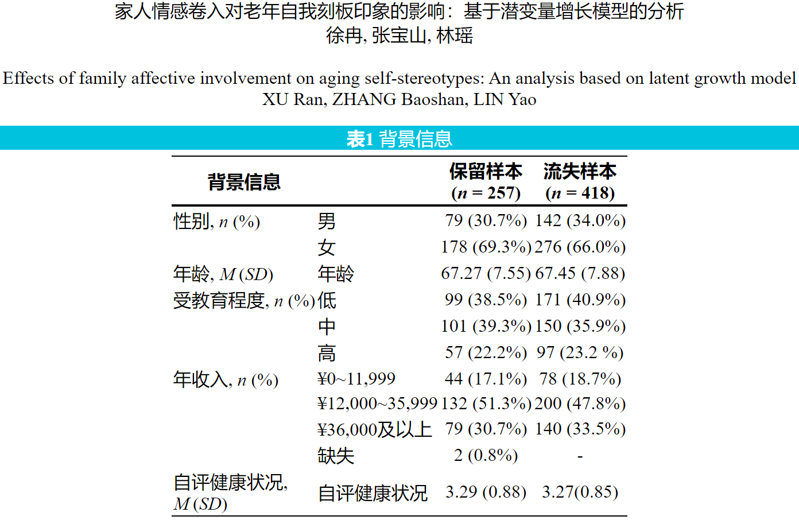

# Basic: regular operations

R 中可以执行各式各样的操作，这些操作都是通过使用 operator 或 function 实现。常见的操作有：

- 基本数学运算
- 关系和逻辑
- 筛选和排序
- 随机抽样
- 其他

注意：绝大多数 operators 和 functions 都支持 recycling rule（详见\@ref(byrow-recycling)）。

由于 subsetting operator 进阶用法的第二步是将拆解的步骤（操作）转换成相应的代码，所以本节中将重点演示如何将部分 operator 和 function 运用在 subsetting 中。


## Basic mathematical operations

### Arithmetic operators

`+` `-` `*` `/` `^` `%%` `%/%` `%*%`

```{r operation_arithmetic_mod_integer_divition}
c(1, 2, 3, 4, 5, 6, 7, 8, 9, 10) %% 5  # 求余数
c(1, 2, 3, 4, 5, 6, 7, 8, 9, 10) %/% 5  # 整除
m1 <- matrix(c(1, 2, 3, 4, 5, 6), nrow = 3, ncol = 2)
m1
m2 <- matrix(c(1, 2, 3, 4, 5, 6), nrow = 2, ncol = 3)
m2
m1 %*% m2   # 矩阵乘法
```

### Functions

#### Extremum and range

  - `max(x)`
  - `min(x)`
  - `range(x)`

```{r operation_arithmetic_max_mix}
m1 <- matrix(c(1, 2, 3, 4), nrow = 2, ncol = 2)
max(m1)
min(m1)
range(m1)
```

#### Sum

  - `sum(x)`，连加求和 \(\sum_{i=1}^{n}x_i\)；
  - `rowSums(x)`，行求和；
  - `colSums(x)`，列求和。

```{r operation_arithmetic_sum}
m1 <- matrix(c(1, 2, 3, 4), nrow = 2, ncol = 2)
m1
sum(m1)
rowSums(m1)  
colSums(m1)
```

#### Average

  - `mean(x)`，均值 \(\frac{\sum_{i=1}^n(x_i)}{n}\)；
  - `rowMeans(x)`，行均值；
  - `colMeans(x)`，列均值。

```{r operation_arithmetic_mean}
m1 <- matrix(c(1, 2, 3, 4), nrow = 2, ncol = 2)
m1
mean(m1)
rowMeans(m1)
colMeans(m1)
```

#### Product

`prod(x)`，连乘求积 \(\prod_{i=1}^nx_i=x_1x_2\cdots x_n\)：
```{r operation_arithmetic_prod}
m1 <- matrix(c(1, 2, 3, 4), nrow = 2, ncol = 2)
prod(m1)
```

#### Round

  - `round(x, digits = 0)`，取整，规则是 4 舍 6 入，逢 5 成双，即逢 5 时向最近的偶数取整，保留`digits`位小数，默认为 0；
  - `floor(x)`，向下取整；
  - `ceiling(x)`，向上取整；
  - `trunc(x)`，保留整数部分，舍弃小数部分。


```{r operation_arithmetic_round}
m1 <- matrix(c(-1.1, -2.5, 3.9, 4.6), nrow = 2, ncol = 2)
m1
round(m1)
floor(m1)  
ceiling(m1)  
trunc(m1)
```

#### Natrual exponential and logorithm

`exp(x)`，自然指数 \(e^{x}\)
```{r operation_arithmetic_exp}
exp(0)
exp(1)
```

`log(x, base = exp(1))`，对数 \(\log_{base}x\)，`base`的默认值是`exp(1)`：
```{r operation_arithmetic_log}
log(1)
log(10, base = 10)
```

#### Others

- Square root: `sqrt(x)`，即\(\sqrt{x}\)。
- Trigonometric Functions: `sin(x)`，`cos(x)`，`tan(x)`
- Absolute value: `abs(x)`，即\(|x|\)。
- Sign:（正数输出 1，负数输出 -1）

`sign(x)`
```{r operation_aritgmetic_sign}
sign(c(-1, 2, -sqrt(2)))
```

- Transpose

`t(x)`，即\(x'\)或\(x^T\)，将`x`转置（沿主对角线反转，行列互换），`x`可以是 matrix 或 data.frame。

```{r operation_arithmetic_t}
a <- matrix(c(1, 2, 3, 4, 5, 6), nrow = 3, ncol = 2)
a
t(a)
```


例子：数据转换（[Skewed Distribution: Definition, Examples](http://www.statisticshowto.com/skewed-distribution/)）


```{r eval = FALSE}
data$Population <- log(data$Population, base = 10)
data$Area <- log(data$Area, base = 10)
```


## Relational and Logical operators

### Relational operators

`>`，`<`，`>=`，`<=`，`==`，`!=`。这些 operators 返回的结果都是 logical：
```{r operation_logical}
m1 <- matrix(c(-1, -2, 0, 4), nrow = 2, ncol = 2)
# 以下代码全部都受到 recycling rule 的作用
m1 > 0
m1 < 0
m1 >= 0
m1 <= 0
m1 == 0
m1 != 0
```

其中，在使用`==`时需要注意，`object == NA`、`object == NaN`，`object == NULL`都是错误写法：
```{r test_NA_NaN_NULL_wrong}
1 == NA
1 == NaN
1 == NULL
```

若想要检测某个 object 究竟是不是`NA`、`NaN`或`NULL`，正确的写法应该是：

```{r test_NA_NaN_NULL_right}
is.na(c(1, 2, NA))
is.nan(c(1, 2, NaN))
is.null(c(1, 2, NULL))
```

Relational operators 在 subsetting 的进阶写法中十分常用。例如，
```{r relation_op_subset}
vec_int <- 1:100
vec_int[vec_int > 50]
```


Basic mathematical operations 和 relational operators 的组合也是 subsetting 进阶写法中常用手段。例如，取绝对值最大的数：
```{r operation_relation_arithmetic_example}
a <- c(-0.1, -0.9, 0.2, 0.4)
a[abs(a) == max(abs(a))]
```

### Logical operator

#### `&` and `&&`

基本结构：`LHS & RHS`，`LHS && RHS`。

`LHS`（left hand side）和`RHS`（right hand side）的结果是长度为 1 的 logical vector 时，`&`和`&&`等价。

| `LHS`  | `RHS`  | 结果    |
|----------|----------|---------|
| `TRUE`   |  `TRUE`  | `TRUE`  |
| `TRUE`   |  `FALSE` | `FALSE` |
| `FALSE`  |  `TRUE`  | `FALSE` |
| `FALSE`  |  `FALSE` | `FALSE` |

```{r operation_relation_and_scalar}
a <- 3
a > 2 & a < 4
a > 2 && a < 4
```

`LHS`和`RHS`的结果是长度大于 1 的 logical vector 时，`&`和`&&`的结果不同。`&`会比较左右两侧的 logical vector 中每一对 element，`&&`会从左往右比，直到有结果为止，本质上相当于只会比较第一个位置上的那对 elements，也正是因为如此，从 4.3.0 开始，R 强制要求`&&`的`LHS`和`RHS`的长度只能为1（因为只比第一个位置），否则就报错，这点在`&&`的帮助页面也有明确说明（详见`` ?`&&` ``）：
```{r operation_logical_and_vector, error = TRUE}
a <- c(1, 2, 3, 4, 5)
a >= 1
a <= 3
a >= 1 & a <= 3
a >= 1 && a <= 3
```

#### `|` and `||`

基本结构：`LHS | RHS`，`LHS || RHS`。

当`LHS`（left hand side）和`RHS`（right hand side）的结果是长度为 1 的 logical vector 时，`|`和`||`等价。

| `LHS`  | `RHS`  | 结果    |
|----------|----------|---------|
| `TRUE`   |  `TRUE`  | `TRUE`  |
| `TRUE`   |  `FALSE` | `TRUE`  |
| `FALSE`  |  `TRUE`  | `TRUE`  |
| `FALSE`  |  `FALSE` | `FALSE` |

```{r operation_relation_or_scalar}
a <- 6
a < 2 | a > 4
a < 2 || a > 4
```

当`LHS`和`RHS`（的结果是长度大于 1 的 logical vector 时，`|`会比较左右两侧的 logical vector 中每一对 element，`||`则会报错：
```{r operation_logical_or_vector, error = TRUE}
a <- c(1, 2, 3, 4, 5)
a <= 2
a >= 4
a <= 2 | a >= 4
a >= 1 || a <= 3
```

**注意**，如果`&`和`|`的`LHS`和`RHS`的长度不一，会触发 recycling rule （详见\@ref(byrow-recycling)）。

```{r error=TRUE}
# 等价于 c(T, F, T) & c(T, T, T)
c(T, F, T) | T
# 等价于 c(T, F, T) | c(T, T, T)
```

#### `!`

基本结构：`!expr`。若`expr`的结果是`TRUE`，则改为`FALSE`；若`FALSE`则改为`TRUE`：
```{r operation_logical_no}
a <- c(1, 2, 3, 4, 5)
a <= 2
!(a <= 2)
!is.na(a)
```

Relational operator 和 logical operator 组合使用，可以非常便捷地完成按照指定条件 subsetting 的任务，尤其是当需要同时满足多个条件时：
```{r operation_relation_logical_example_subsetting}
m1 <- matrix(c(0.5, 0.1, 0.8, 0.25), nrow = 2, ncol = 2)
m1
m1[m1 > 0.2 & m1 < 0.8]
m1[m1 < 0.3 | m1 > 0.7]
m1[!(m1 < 0.3 | m1 > 0.7)]
```


## Locate, match and sort

### Locate

`which(x)`，输出`x`中所有`TRUE`的位置信息，`x`必须是一个 logical object。

```{r operation_location}
a <- runif(5)
a
which(a == max(a)) # 等价于which.max(a)，类似的还有which.min(a)
which(a > 0.5)
which(a > 0.1 & a < 0.9)
```

使用`which()`通常不是为了将符合条件的元素取出，而是为了将这些元素的位置找出来，起个名字并保存在 Environment 里，方便后续单独处理这些元素的时候可以直接使用位置索引信息来定位。如果只是需要将符合条件的所有元素取出来，只用 relational operator 就足够了。
```{r operation_which}
a <- c(0.5, 0.1, 0.8, 0.25)
a
a[which(a > 0.5)]
a[a > 0.5]
```

如果`x`是一个有`dim`的`array`或`matrix`，`which(x)`可以通过设定`arr.ind = TRUE`来输出按`dim`标识的 index：
```{r operation_which_arrind}
m1 <- matrix(1:4, 2, 2)
which(m1 == 3, arr.ind = TRUE)
```

### Match

`%in%`: 返回一个和逻辑向量，表示左边的值在右边的依据值中是否有匹配。

`x %in% table`

- `x`: 被匹配的值。
- `table`: 匹配时依据的值。

```{r}
vec <- c(1, 2, 3)
vec_all <- c(6, 1, 5, 6, 1, 4, 4, 2, 10, 5)
vec %in% vec_all
vec_all %in% vec
```

`%in%`可以用于挑选数据的指定列，例如：
```{r operataion_in}
vars <- c("x", "y", "z")
df <- data.frame(
  x = 1, 
  n = 2, 
  z = 3, 
  m = 4, 
  n = 5, 
  y = 5
)
df_select <- df[names(df) %in% vars]
df_select
```

`%in%`对于匹配的定义比`==`考虑的更完备，对一些特殊的匹配情况做了处理，如`NA`，只有匹配`NA`时才会返回`TRUE`的结果，否则返回`FALSE`，
```{r in_na}
c(1, NA, 3) %in% c(1:10)
c(1, NA, 3) %in% NA # equivalent to is.na(c(1, NA, 3))
```

正是因为`%in%`考虑更加完备，故`%in%`可以替代`==`，用在 subsetting 上，
```{r in_subsetting}
df <- data.frame(x = c(1, NA, 1, 2, 4), y = c(2, 1, 1, 3, 5))
df$x == 1
df[df$x == 1 & df$y == 1, ]
df[df$x %in% 1 & df$y %in% 1, ]
```

### Sort

- `sort(x, decreasing = FALSE)`，将`x`升序排列（默认），输出排列后的`x`。`decreasing`是可选 argument。`decreasing = TRUE`则是按照降序排序列。

```{r operation_sort}
a <- c(5, 1, 8, 2.5)
a
sort(a)
sort(a, decreasing = TRUE)
```

- `order(..., decreasing = FALSE)`，`...`是一个或多个`object`。`decreasing`是可选`argument`，`decreasing = TRUE`表示按照降序排序列。

`order()`输出的其实是`object`中元素位置的具体调整方式，根据该方式调整以后就实现了排序（升序或降序）。所以，`order()`实际上给出的是位置信息。

a. 无重复元素

```{r operation_order_notie}
a <- c(5, 1, 8, 2.5)
order(a)
order(a, decreasing = TRUE)
```


b. 有重复元素

当输入的单个`object`有重复元素（即`ties`，表示一个独特的值同时有多个位置索引）时，默认是按照元素出现的先后顺序来排序，
```{r operation_order_ties}
a <- c(5, 1, 8, 1)
order(a)
order(a, decreasing = TRUE)
```

如果有额外的线索可以区分重复元素时，`order()`可以将这些重复元素按照额外线索排序，
```{r operation_order_ties_extra_clue}
score <- c(90, 95, 99, 95)
id <- c(4, 3, 2, 1)
order(score, id)
order(score, id, decreasing = TRUE)
```

总结一下，当输入 1 个 object 时，`order()`排序的是这个`object`；当输入多个`object`时（这些`object`都必须是同样长度），`order()`排序的依旧是第一个`object`，只不过该 object 中的重复元素是以第 2 个 object 中对应位置上的元素大小为依据，若这些元素依旧是重复的，则按照第 3 个 object 中对应位置上的元素大小为依据，依此类推。

`order()`对字符也有效，默认升序，数字按从小到大，英文按字母，中文按拼音顺序，三者的优先级是数字 > 英文字母 > 中文拼音：
```{r operation_order_letter}
vec_cha <- c("3", "2", "a", "b", "啊", "呀")
order(vec_cha)
vec_cha[order(vec_cha)]
```

`order()`常用于根据某一列重新排列整个数据。例如根据`score_math`降序排列：

```{r operation_order_example}
data_set1 <- data.frame(
  name = c("小红", "小明", "小白", "小黑"), 
  id = c(1, 4, 2, 3),
  score_math = c(90, 95, 98, 95)
)
data_set1[order(data_set1$score_math, id, decreasing = TRUE), ]
```


## Randomness

### Generating random number following specific distribution

从指定的分布中随机抽取指定数量的数是模拟（simulation）研究中的常见任务，通常都是由生成随机数的函数来完成的。这类函数的命名特点是`rxxx()`，其中`r`代表 random，`xxx`一般都是某种分布的缩写。

- `runif(n, min = 0, max = 1)`生成`n`个在$(\min,\max)$这个开区间（默认为$(0,1)$）内的均匀（uniform）分布随机数。

```{r runif}
runif(5)
```

- `rnorm(n, mean = 0, sd = 1)`，生成`n`个服从$N$($\mu=$`mean`, $\sigma=$`sd`)的正态（normal）分布（默认是标准正态分布$N(0,1)$）随机数。

```{r rnorm}
vec_rnd <- rnorm(5)
vec_rnd
mean(vec_rnd)
sd(vec_rnd)
vec_rnd <- rnorm(5, mean = 20, sd = 10)
vec_rnd
mean(vec_rnd)
sd(vec_rnd)
```

其他类似的专门用来生成指定分布随机数的函数还有：

- `rt()`，生成服从指定$t$分布随机数；
- `rchisq()`，生成服从指定$\chi^2$分布随机数；
- `rbeta()`，生成服从指定$\beta$分布随机数；
- `rf()`，生成服从指定$F$分布随机数。


### Other randomness-based sampling functions

以最常用的`sample()`为例：

`sample(x, size, replace = FALSE, prob = NULL)`，从`x`中随机取出`size`个元素。`x`可以是一个 vector 或 integer scalar，当`x`是 integer scalar 时，等价于`1:x`；`size`是 integer。可选 argument：

a. `replace = TRUE`表示有放回抽样；
b. `prob`是一个向量，每一个元素是`x`中对应元素被抽中的概率。

```{r operation_others_sample}
sample(5, 1)  # 等价于 sample(5, 1, prob = rep(1/5, 5))
sample(5, 5)
sample(5, 5, replace = TRUE)
```

```{r operation_others_sample_pro}
sample(
  6, 
  size = 6, 
  replace = TRUE, 
  prob = c(1/6, 1/6, 1/6, 1/6, 1/3, 1/3)
)
```

随机抽样的一个典型的应用场景是自助法（Bootstrap），从样本中随机取出多批指定大小的数据，当作是平行样本。以英雄联盟数据集为例：
```{r operation_others_sample_bootstrap, warning = TRUE}
library(openxlsx)
data_ori <- read.xlsx("F:/Nutstore backup/R/codes/RBA/data/Arena of Valor_midterm dataset.xlsx")
data_sample <- data_ori[sample(nrow(data_ori), 30), ]
```


### Fun fact: everything is `runif()` (optional) {#runif-is-everyrthing}

在 R 中，绝大多数生成指定分布随机数的函数本质上都是基于`runif()`的。下面将以`rnorm()`为例来讲解。

- `runif()`

首先看下 R 中`runif()`的源码，如下：
```{r runif_source, echo = FALSE}
runif
```
`C_runif()`
在实际执行时是调用 [statsR.h](https://github.com/SurajGupta/r-source/blob/a28e609e72ed7c47f6ddfbb86c85279a0750f0b7/src/library/stats/src/statsR.h#L141) 中声明的`do_runif()`：
```{c eval = FALSE}
SEXP do_runif(SEXP sn, SEXP sa, SEXP sb);
```
调用`do_runif()`的代码在 [random.c](https://github.com/SurajGupta/r-source/blob/a28e609e72ed7c47f6ddfbb86c85279a0750f0b7/src/library/stats/src/random.c#227) 的第 227 行：
```{c eval = FALSE}
DEFRAND2_REAL(runif)
```
其中，`DEFRAND2_REAL()`的定义在 [random.c](https://github.com/SurajGupta/r-source/blob/a28e609e72ed7c47f6ddfbb86c85279a0750f0b7/src/library/stats/src/random.c#208) 的第 208-211 行：
```{c eval = FALSE}
#define DEFRAND2_REAL(name) \
  SEXP do_##name(SEXP sn, SEXP sa, SEXP sb) { \
    return random2(sn, sa, sb, name, REALSXP); \
  }
```
大致意思是执行`do_runif(sn, sa, sb)`会调用`random2(sn, sa, sb, name, REALSXP)`，其定义在 [random.c](https://github.com/SurajGupta/r-source/blob/a28e609e72ed7c47f6ddfbb86c85279a0750f0b7/src/library/stats/src/random.c#164) 的第 164-223 行，其中`sn`对应`runif(n, min, max)`中的`n`——将生成的随机数的个数，`sa`对应`min`，`sb`对应`max`，`name`对应 `runif()`的底层 C 语言函数。`random2(sn, sa, sb, name, REALSXP)`本质上是重复调用 C 语言版的`runif()`，共计`sn`次（详见 [random.c](https://github.com/SurajGupta/r-source/blob/a28e609e72ed7c47f6ddfbb86c85279a0750f0b7/src/library/stats/src/random.c#193) 的第 193-195 行）：
```{c eval = FALSE}
R_xlen_t n = resultLength(sn);
for (R_xlen_t i = 0; i < n; i++) {
  rx = fn(ra[i % na], rb[i % nb]);} 
  // when executing random2, name is fn within the life cycle of random2
}
```
综上，只要查看 C 语言版的`runif()`即可，其定义在 [runif.c](https://github.com/SurajGupta/r-source/blob/master/src/nmath/runif.c#24) 中，如下：
```{c eval = FALSE}
#include "nmath.h"

double runif(double a, double b)
{
  if (!R_FINITE(a) || !R_FINITE(b) || b < a)	ML_ERR_return_NAN;

  if (a == b)
	  return a;
  else {
	  double u;
	  /* This is true of all builtin generators, but protect against
	     user-supplied ones */
	  do {u = unif_rand();} while (u <= 0 || u >= 1);
	  return a + (b - a) * u;
  }
}
```
其中，负责最终生成随机数的是另一个 C 语言函数`unif_rand()`，位于 [RNG.c](https://github.com/SurajGupta/r-source/blob/master/src/main/RNG.c#105) 的第 105 -179 行。

- `rnorm()`

再来看看`rnorm()`，其中 R 语言中能查看到的源码如下：
```{r echo = FALSE}
rnorm
```
与`runif()`类似，对应`do_rnorm()`：
```{c eval = FALSE}
SEXP do_rnorm(SEXP sn, SEXP sa, SEXP sb);
```
这个声明指向`DEFRAND2_REAL(rnorm)`，本质上也是调用`random2()`将 C 语言版的`rnorm()`重复执行`sn`次。进一步检索，能查到 C 语言版的`rnorm()`在 [rnorm.c](https://github.com/SurajGupta/r-source/blob/master/src/nmath/rnorm.c#31) 中，定义如下：
```{c eval = FALSE}
#include "nmath.h"

double rnorm(double mu, double sigma)
{
  if (ISNAN(mu) || !R_FINITE(sigma) || sigma < 0.)
    ML_ERR_return_NAN;
  if (sigma == 0. || !R_FINITE(mu))
	  return mu; /* includes mu = +/- Inf with finite sigma */
  else
	  return mu + sigma * norm_rand();
}
```
不难发现，核心的随机数生成函数为`norm_rand()`，依旧是一个 C 语言函数，其定义详见 [snorm.c](https://github.com/SurajGupta/r-source/blob/master/src/nmath/snorm.c)。由于 R 语言中生成服从正态分布随机数的算法有多种，都包含在 `norm_rand()` 中。但默认算法是`inversion`（详见`?RNG`的**Details**部分），故只截取与之相关的部分，对应的是 snorm.c 的第 [265-270](https://github.com/SurajGupta/r-source/blob/master/src/nmath/snorm.c#265) 行，如下：
```{c eval = FALSE}
case INVERSION:
#define BIG 134217728 /* 2^27 */
/* unif_rand() alone is not of high enough precision */
u1 = unif_rand();
u1 = (int)(BIG*u1) + unif_rand();
return qnorm5(u1/BIG, 0.0, 1.0, 1, 0);
```
其中负责生成随机数的核心函数同样是`unif_rand()`，所以`rnorm()`是基于`runif()`的。

- `sample()`

同理，也可查询到`sample()`是基于`runif()`的。`sample()`的 R 语言源码如下：
```{r echo=FALSE}
sample
```
继续查看`sample.int()`的 R 语言源码：
```{r echo = FALSE}
sample.int
```
核心函数为`.Internal(sample())`，对应 [random.c](https://github.com/SurajGupta/r-source/blob/a28e609e72ed7c47f6ddfbb86c85279a0750f0b7/src/main/random.c#L461) 中的`do_sample()`（第 461-553 行）。以最常见的`sample()`用法为例，如`sampe(1:5, size = 1, replace = FALSE, prob = NULL)`，对应执行是`do_sample()`最后一部分的分支代码（533-547 行）：
```{c eval = FALSE}
int n = (int) dn;
PROTECT(y = allocVector(INTSXP, k));
int *iy = INTEGER(y);
/* avoid allocation for a single sample */
if (replace || k < 2) {
  for (int i = 0; i < k; i++) iy[i] = (int)(dn * unif_rand() + 1);
} else {
	int *x = (int *)R_alloc(n, sizeof(int));
	for (int i = 0; i < n; i++) x[i] = i;
	for (int i = 0; i < k; i++) {
    int j = (int)(n * unif_rand());
    iy[i] = x[j] + 1;
    x[j] = x[--n];
	}
}
```
其中负责生成随机数的核心函数依旧是`unif_rand()`。

以上源码的追踪均是基于: [fossies.org](https://fossies.org/dox/R-4.4.1/index.html)。


### Control randomness

#### Why do we need and how to control randomness

模拟（simulation）研究常见于方法学研究，这类研究的目的可以是改进某种方法。为了实现这一目的，需要模拟生成很多批数据，且这些数据需具备随机性，这个过程称作是重复实验（replication）。重复实验本质上是在近似实际研究中多次收集数据的过程。

假定一种非常极端的现象，某学者提出了一种新的统计方法，并使用 R 语言实现了该方法。该方法的代码只会在一种特定的条件下才会出错，大约是每生成 1000 批模拟数据才会有 1 批是符合这种特定条件。但由于生成数据是随机的，根本无法预计是哪一次重复实验会出错，也就无法稳定复现错误来 debug。所以，就需要使用控制随机数种子的技巧让随机有迹可循，对应的函数为`set.seed()`。

`set.seed(integer)`

- `integer`: a single value, interpreted as an integer.

R 里面所有与随机行为有关的代码（如`sample()`，`rnorm()`，`runif()`）本质上都是伪随机，都是通过激活某种随机数生成器（random number generator， RNG）来实现的。如果把 RNG 理解为一个函数 $y=f(x)$，可以简单地认为每次激活 RNG 都需要给定一个起点$x$，最终的$y$就是随机行为。如果起点一致，那么两次随机行为的结果就是完全一致的。`set.seed()`就是用来控制每次激活 RNG 时使用的起点——随机数种子（seed）。
```{r setseed_simple}
# set.seed 之前，结果不同
rnorm(5) 
rnorm(5)
# set.seed 之后，结果相同
set.seed(1)
rnorm(5)
set.seed(1)
rnorm(5)
```

学会了`set.seed()`，就可以来整点活了
```{r season_greeting}
set.seed(2219868)
greeting <- sample(letters,5,T)
set.seed(6024)
year <- sample(0:9,4,T)
cat(paste(greeting, collapse = ""), paste(year, collapse = ""))
```
以上代码改编自 [brrybk in the rstatsmemes subreddit](https://www.reddit.com/r/rstatsmemes/comments/zmpc8d/seasons_greetings/)。思考一下，如何令第 2 个 `sample()` 产生出 `[1] 2 0 2 4`?
```{r season_greeting_solution, eval = FALSE, include = FALSE}
i <- 1
while (i < 1e7) {
  set.seed(i)
  nums <- sample(0:9, size = 4, replace = TRUE)
  if (all(nums == c(2, 0, 2, 4))) {
    print(i)
    break
  } else {
    i <- i + 1
  }
}
```


#### A slightly deeper understanding of `set.seed()` (optional)

在 R 中，所有 seeds 都存储在`.Random.seed`这个 vector 里，不同 RNG 产生的`.Random.seed`不一样。R 中默认的 RNG 是 Mersenne-Twister。Mersenne-Twister 同时是众多编程语言（[R](https://www.stat.ethz.ch/R-manual/R-devel/library/base/html/Random.html), [Python](https://docs.python.org/3/library/random.html)，[C++11](https://en.cppreference.com/w/cpp/numeric/random/mersenne_twister_engine)）的默认 RNG，其本质上是一个算法，可以从数学上理解，但过于复杂。下面将从代码的角度来简单讲解 Mersenne-Twister 是如何在 R 中实现的。

Mersenne-Twister 对应的`.Random.seed`是一个长度为 626 的 integer vector，第 1 个位置上存储的是代表 RNG 种类的编号，第 2 个位置上储存的是下一次激活 RNG 将使用的 seed 位置序号，第 3-626 个位置上储存的是 624 个 seeds。
```{r seed}
.Random.seed[1:5]
length(.Random.seed)
```
在不改变 RNG 种类的情况下，`set.seed()`只会改变`.Random.seed`的第 2-626 个位置上的信息——将下一次激活 RNG 将使用的 seed 位置序号重置为 624，并更换所有 624 个 seeds。
```{r setseed}
set.seed(123)
.Random.seed[1:5]
set.seed(1)
.Random.seed[1:5]
```
在使用了`set.seed()`以后，只要是执行含有随机行为的代码，RNG 运用`.Random.seed`的基本流程就是：

- 一次随机行为激活一次 RNG，激活时按顺序使用一个 seed，
- RNG 激活后更新`.Random.seed`第 2 个位置上记录的 seed 位置序号。

```{r seed_position}
set.seed(1)
.Random.seed[1:5]
runif(1) # 共有 1 次随机行为
.Random.seed[1:5]
runif(2) # 共有 2 次随机行为
.Random.seed[1:5]
runif(3) # 共有 3 次随机行为
.Random.seed[1:5]
```
但不难看出以上代码的运行结果似乎和前述的基本流程有所出入，`.Random.seed`在执行`runif(1)`后会改变，然后就固定不变了。这和 Mersenne-Twister 的算法有关，下面来解释一下背后的原因。

如\@ref(runif-is-everyrthing)所述，R 中`runif(1)`本质上是调用 C 语言函数`random2()` 1 次。在生成随机数前，`random2()`的第 [188](https://github.com/SurajGupta/r-source/blob/a28e609e72ed7c47f6ddfbb86c85279a0750f0b7/src/library/stats/src/random.c#164) 行会先执行`GetRNGstate()`，该函数的定义详见 [RNG.c](https://github.com/SurajGupta/r-source/blob/a28e609e72ed7c47f6ddfbb86c85279a0750f0b7/src/main/RNG.c#397) 的第 397-422 行。其中，第 401-406 行表明`GetRNGstate()`会先尝试获取已经存在的 seeds（即由`set.seed(1)`更新的`.Random.seed`的第 2-626 个元素），如果没有则此时会自动生成一组随机的 seeds：
```{c eval = FALSE}
SEXP seeds;

/* look only in the workspace */
seeds = GetSeedsFromVar();
if (seeds == R_UnboundValue) {
  Randomize(RNG_kind);
```
后续就会调用`unif_rand()`，该函数的定义详见 [RNG.c](https://github.com/SurajGupta/r-source/blob/a28e609e72ed7c47f6ddfbb86c85279a0750f0b7/src/main/RNG.c#109) 的第 109-183 行。`unif_rand()`中激活 Mersenne-Twister 的代码在第 [136-137](https://github.com/SurajGupta/r-source/blob/a28e609e72ed7c47f6ddfbb86c85279a0750f0b7/src/main/RNG.c#136) 行：
```{c eval = FALSE}
case MERSENNE_TWISTER:
return fixup(MT_genrand());
```
其中，`fixup()`函数的定义在 [RNG.c](https://github.com/SurajGupta/r-source/blob/a28e609e72ed7c47f6ddfbb86c85279a0750f0b7/src/main/RNG.c#100) 的第 100-106  行，如下：
```{c eval = FALSE}
#define i2_32m1 2.328306437080797e-10/* = 1/(2^32 - 1) */
static double fixup(double x)
{
  /* ensure 0 and 1 are never returned */
  if(x <= 0.0) return 0.5*i2_32m1;
  if((1.0 - x) <= 0.0) return 1.0 - 0.5*i2_32m1;
  return x;
}
```
不难看出这个函数只是用来保证生成出来的随机数不会恰好是 0 或 1。因此，`unif_rand()`中负责生成随机数的核心函数是`MT_genrand()`，其定义在 [RNG.c](https://github.com/SurajGupta/r-source/blob/a28e609e72ed7c47f6ddfbb86c85279a0750f0b7/src/main/RNG.c#687) 的第 687-732 行。下面只摘出其中关键的部分并加以注释（`//`部分）：
```{c eval = FALSE}
static Int32 dummy[628]; // allow for optimizing compilers to read over bound

// dummy is an array, of which the 1st element is the current position, 
// the 2-625 elements are the 624 seeds.
// after set.seed(1), dummy[0] = 624

#define N 624
#define M 397
#define UPPER_MASK 0x80000000 /* most significant w-r bits */
#define LOWER_MASK 0x7fffffff /* least significant r bits */

static Int32 *mt = dummy+1; /* the array for the state vector  */

// mt = dummy with the 1st removed, mt are the 624 seeds, if modified, dummy
// will be updated

static int mti=N+1; /* mti==N+1 means mt[N] is not initialized */

static double MT_genrand(void)
{
  Int32 y;
  static Int32 mag01[2]={0x0, MATRIX_A};
  /* mag01[x] = x * MATRIX_A  for x=0,1 */

  mti = dummy[0]; /**/
  
  // mti = 624, the following if body will be executed

  if (mti >= N) { /* generate N words at one time */
    int kk;

    if (mti == N+1)   /* if sgenrand() has not been called, */
      MT_sgenrand(4357); /* a default initial seed is used   */

    for (kk = 0; kk < N - M; kk++) {
      y = (mt[kk] & UPPER_MASK) | (mt[kk+1] & LOWER_MASK);
      mt[kk] = mt[kk+M] ^ (y >> 1) ^ mag01[y & 0x1];
    }
    // scramble the 1-397 seeds
    for (; kk < N - 1; kk++) {
      y = (mt[kk] & UPPER_MASK) | (mt[kk+1] & LOWER_MASK);
      mt[kk] = mt[kk+(M-N)] ^ (y >> 1) ^ mag01[y & 0x1];
    }
    y = (mt[N-1] & UPPER_MASK) | (mt[0] & LOWER_MASK);
    mt[N-1] = mt[M-1] ^ (y >> 1) ^ mag01[y & 0x1];
    // then scramble the 398-624 seeds
  
    mti = 0; 
    // update the current position
  }

  y = mt[mti++];
  // use the current value of mti, 0, as the index, extract mt[0]
  // then mti = mit + 1
  
  y ^= TEMPERING_SHIFT_U(y);
  y ^= TEMPERING_SHIFT_S(y) & TEMPERING_MASK_B;
  y ^= TEMPERING_SHIFT_T(y) & TEMPERING_MASK_C;
  y ^= TEMPERING_SHIFT_L(y);
  // use mt[0] as the seed to generate 1 random number 
  
  dummy[0] = mti;
  // record the current position

  return ( (double)y * 2.3283064365386963e-10 ); /* reals: [0,1)-interval */
}
```
所以，当`set.seed(1)`重置`.Random.seed`第 2 个位置上记录的 seed 位置序号为 624 后，第一次激活 Mersenne-Twister 时就会把 624 个 seeds 全部重新改变一次。此后再激活 Mersenne-Twister 时就会因为 seed 位置序号不满足条件（`mti<=N`）自动跳过改变所有 seeds 的语句，seeds 就保持不变。可想而知，`set.seed(1)`后每激活 Mersenne-Twister 624 次，所有的 624 个 seeds 就会被自动更新：
```{r seed_autoupdate}
set.seed(1)
.Random.seed[1:5]
do_not_display <- runif(624)
.Random.seed[1:5]
do_not_display <- runif(624)
.Random.seed[1:5]
```
这种周期性自动更新全部 seeds 的设定可以避免 Mersenne-Twister 生成出重复的随机数。不过，由于`set.seed(1)`的存在，所以相当于人为设定了 seeds 自动更新的起点。因此，只要`set.seed(integer)`中的`integer`不变，那后续所有含有随机行为的代码使用的 seed 顺序就是固定的。只要代码的执行顺序不变，即便是随机抽样也是可以完美重复出来：
```{r setseed_recommended_usage}
set.seed(1)
df1 <- iris[sample(nrow(iris), 3), ]
rnd1 <- runif(3)
df1
rnd1
set.seed(1)
df2 <- iris[sample(nrow(iris), 3), ]
rnd2 <- runif(3)
df2
rnd2
```
需要注意的是，Mersenne-Twister 会在一些特殊的情况下出现大面积重复：
```{r}
set.seed(0)
seeds_1 <- .Random.seed[-1]
runif(10)
set.seed(1)
seeds_2 <- .Random.seed[-1]
runif(10)
sum(seeds_1 %in% seeds_2)
```
由于无法准确预测什么时候会出现这个问题，因此可以考虑：

1. 使用其他 RNG，
2. 在 simulation 自定义一段代码来自动调整`integer`，以下是一个简单的示例：

```{r eval = FALSE}
seed_old <- .Random.seed[-1]
int <- 0
is_change <- TRUE
while (is_change) {
  set.seed(int)
  seed_new <- .Random.seed[-1]
  if (sum(seed_old %in% seed_new) < 100) {
    is_change <- FALSE 
  } else {
    is_change <- TRUE
    int <- int + 1
  }
}
```


## Others

### Combine

- `c(...)`，将多个 object 合并成一个 vector，`...`为要合并的 object。
- `cbind(...)`，将多个 objects，视作是 columns，将多个 object 横向合并成一个 object，`...`为要合并的 object。
- `rbind(...)`，将多个 objects 视作是 rows，纵向合并成一个 object，`...`为要合并的 object。

```{r operation_others_bind}
a <- c(1, 2, 3)
b <- c(4, 5, 6)
cbind(a, b)
rbind(a, b)
```

### Get the number of

- `length(x)`，返回`x`中 element 的个数；
- `nrow(x)`或`NROW(x)`，返回`x`的行数，如果`x`没有行数的信息，返回`NULL`；
- `ncol(x)`或`NCOL(x)`，返回`x`的列数，如果`x`没有列数的信息，返回`NULL`；
- `nchar(x)`，返回`x`各 element 的字符个数。

```{r operation_others_length}
df <- data.frame(number = c(1, 2, 3), letter = c("a", "b", "c"))
length(df)
nrow(df)
ncol(df)
fruits <- c("banana", "apple", "pineapple", "melon")
length(fruits)
nrow(fruits)
ncol(fruits)
nchar(fruits)
```

### Generate sequence

#### Operator

`from:to`，生成有序整数数列。`from`为数列的起点；`to`为数列的终点。

```{r operation_others_colon}
1:100
```

`:`可以用来生成行索引，在需要分半数据进行统计分析（交叉验证，复本信度等）时快速取出数据子集。以英雄联盟数据集为例：
```{r operation_others_colon_split}
library(openxlsx)
data_ori <- read.xlsx("F:/Nutstore backup/R/codes/RBA/data/Arena of Valor_midterm dataset.xlsx")
data_subset1 <- data_ori[1:trunc(nrow(data_ori)/2), ]
data_subset2 <- data_ori[(trunc(nrow(data_ori)/2) + 1):nrow(data_ori), ]
```

#### Functions： 

`seq(from = 1, to = 1, by = ((to - from)/(length.out - 1)), length.out = NULL)`，生成有序数列。`from`为数列的起点，`to`为数列的终点。可选 argument：

a. `by`为步长，即后一个数和前一个数之差；
b. `length.out`为生成数列的长度。

```{r operation_others_seq}
seq()
seq(from = 1, to = 100)  # 等价于 1:100
seq(1, 100, by = 3)
seq(1, 100, length.out = 34)
```

`seq()`可以用于快速奇偶分半数据。以英雄联盟数据集为例：
```{r operation_others_rep_oddeven_split}
library(openxlsx)
data_ori <- read.xlsx("F:/Nutstore backup/R/codes/RBA/data/Arena of Valor_midterm dataset.xlsx")
data_ori <- cbind(ID = 1:nrow(data_ori), data_ori)
data_subset1 <- data_ori[seq(1, nrow(data_ori), 2), ]
data_subset2 <- data_ori[seq(2, nrow(data_ori), 2), ]
```

`rep(x, times = 1, length.out = NA, each = 1)`，生成重复序列。
```{r operation_others_rep}
rep(0, times = 3)
rep(c(1, 2, 3), times = 3)
rep(c(1, 2, 3), times = 3, length.out = 10)
rep(c(1, 2, 3), times = 3, length.out = 30, each = 3)
```

`rep()`可以巧妙地和`subsetting`的操作相结合，来实现快速复制矩阵。例如以一个 \(2\times2\) 的矩阵为最小 element，复制出一个 \(2 \times 2\) 的大矩阵：
```{r operation_others_repmatrix}
m1 <- matrix(1:4, nrow = 2, ncol = 2)
m1[rep(1:nrow(m1), times = 2), rep(1:ncol(m1), times = 2)]
```

来源：[R中是否有复制平铺矩阵的函数](https://d.cosx.org/d/107403-107403)


### Concatenate strings 

`paste(..., sep = " ", collapse = NULL)`，将`object`按照指定方式拼接成字符串。`...`是一个或多个待拼接的`object`。可选`argument`如下：

a. `sep = " "`是拼接时用来分隔各项的字符串，默认值是一个英文空格；
b. `collapse = NULL`
表示拼接好的各项最后合并成一个字符串，各项间用`collapse`的值来分隔，默认值是`NULL`，即不合并成一个字符串。

```{r operation_others_paste}
paste(1:12)  # 等价于 as.character(1:12)
paste(1:12, "month")
paste(1:12, c("st", "nd", "rd", rep("th", 9)), "month")
paste(1:12, c("st", "nd", "rd", rep("th", 9)), "month", sep = "")
paste(
  1:12, c("st", "nd", "rd", rep("th", 9)), "month", 
  sep = "", collapse = ","
)
```

`paste()`可用于自动生成符合要求的文件名：
```{r operation_others_paste_example_varname}
num_subsets <- 10
filenames <- paste(
  1:num_subsets, 
  ".txt",
  sep = ""
)
filenames
write.table(data_subset1, filenames[1])
write.table(data_subset2, filenames[2])
```

只要是需要按照一定的规律生成字符串，就要想到`paste()`。


### Print to console

有 2 个十分常用的 functions：`print()`和`cat()`。

- `print(x)`，将`x`的 value 输出在 Console。`print(x)`和`x`在单独执行时都会输出`x`的 value，但二者是有几个细微的区别：
  a. 通过 Source 的方式执行当前活动脚本中所有的代码时，`print(x)`会在 Console 输出`x`的 value，`x`则不会；
  b. 在 function 内部使用`print(x)`，在执行 function 时会在 Console 输出`x`的 value，`x`则不会；
  c. 在循环体内部使用`print(x)`会在 Console 输出`x`的 value，`x`则不会（具体例子将在\@ref(control-flow)章节展示）。
  
<video src="images/print_source.mp4" width="100%" controls="controls"></video>

<video src="images/print_function.mp4" width="100%" controls="controls"></video>

- `cat(..., sep = " ", fill = FALSE, labels = NULL)`，将输入的一个或多个 object 拼接后输出在 Console。可选 argument：
  a. `sep = " "`，拼接时用来分隔各项的字符串。

```{r operation_others_cat}
cat("The correlation between a and b is", 0.6)
cat("The correlation between a and b is", 0.6, sep = "_")
cat("The correlation between a and b is\n", 0.6)
cat(
  "The correlation between a and b is", 
  rep("+", 100), 
  0.6, 
  rep("+", 100), 
  sep = ""
)
```

### Head and tail

`head(x, n = 6L)`和`tail(x, n = 6L)`，在`Console`输出`x`的前 6 或后 6 个元素（`x`为`vector`）/行（`x`为`matrix`或`data.frame`）。可选`argument`：

a. `n`表示输出的个/行数，默认为 6。

```{r operation_others_head_tail}
m1 <- matrix(1:100, nrow = 10, ncol = 10)
head(m1)
tail(m1)
```

### Continuous to discrete 

`cut(x, breaks)`

- `x`: a numeric vector which is to be converted to a factor by cutting.
- `breaks`: either a numeric vector of two or more unique cut points or a single number (greater than or equal to 2) giving the number of intervals into which x is to be cut.

```{r cut_basic}
cut(1:10, breaks = c(0, 3, 6, 10))
```



```{r acta_psy_table1}
# Simulate the demographic data reported in 
#  http://journal.psych.ac.cn/xlxb/article/2021/0439-755X/0439-755X-53-11-1215.shtml

Income <- c(
  sample(11999, 122), 
  sample(12000:35999, 332),
  sample(36000:100000, 219)
)
Income <- c(Income, NA, NA)
is_lost <- rep(1, length(Income))
is_lost[c(
  sample(122, 78), 
  sample(123:454, 200), 
  sample(456:673, 140)
)] <- 0
is_lost[c(length(Income) - 1, length(Income))] <- NA
data_xb <- data.frame(Income, is_lost)
head(data_xb)
```

```{r acta_psy_table1-solution}
data_xb$Income <- cut(
  data_xb$Income, 
  breaks = c(0, 11999, 35999, 100000), 
  labels = c("￥0-11,999", "￥12,000-35,999", "￥36,000及以上")
)
data_xb$is_lost <- factor(
  data_xb$is_lost, 
  levels = c(1, 0), 
  labels = c("保留样本", "流失样本")
)
as.matrix(table(data_xb))
```

### Built-in constants

 R 中内置有如下常量：
```{r operation_others_builtin_constants}
pi
LETTERS
letters
month.abb
month.name
```


## Precedence of operators (optional)

目前学过的 operators 可以大致归为以下几类：

|    类                       | 包括                                 | 如何查看帮助 |
|-----------------------------|--------------------------------------|----------------|
| `subsetting` （取子集）     | `$` `@` `[[]]` `[]`          | `` `r '?\x60$\x60'` ``（`$`可替换为任意一个`subsetting operator`）或 `?Extract` |     
| `Colon`      （分号）       | `:`                          | `` `r '?\x60:\x60'` `` 或 `?Colon `|
| `Arithmetic` （算术）       | `+`, `-`, `*`, `/`, `^`, `%%`, `%/%`, `%*%` | `` `r '?\x60+\x60'` `` （`+`可替换为任意一个 Arithmetic operator） 或`?Arithmetic`，`?matmult`|     
| `Relational` （关系）       | `>`, `<`, `<=`, `>=`, `==`, `!=`     | `` `r '?\x60>\x60'` `` （`>`可替换为任意一个 Relation operator）或 `?Comparison`|
| `Logical`    （逻辑）       | `!`, `&`, `&&`, `|`, `||`            | `` `r '?\x60!\x60'` `` （`!`可替换为任意一个 Logical operator）或 `?Logic` |
| `Assignment` （分配）       | `<-`             | `` `r '?\x60<-\x60'` `` 或 `?assignOps` |

注意：`` ` ` `` 为反单引号，当某个 name 本身是非法字符（如已经定义的 operator）或者违背 name 命名规则时，就需要加反单引号来标识，否则会被当作是语句直接执行。

以上各 operator 在同一个语句中执行时是有优先顺序（precedence）的，就好比是加减乘除运算有优先顺序一样，同一个式子中先算乘除后算加减。 R 中各 operator 的优先顺序如下：


如果没有注意优先顺序，容易出现代码的执行结果和预期不一致的情况，例如：
```{r operation_operator_precedence, error = TRUE}
a <- runif(10)
a
#  把最大值最小值所在位置找出来
position <- 1:length(a)[as.logical(a == max(a) + a == min(a))] 
position
```

如果需要保证低优先度的操作被完整执行，不受高优先度代码的影响，需要使用`()`把低优先度的操作包起来：
```{r operation_operator_precedence_parenthesis}
a <- runif(10)
a
#  把最大值最小值所在位置找出来
position <- (1:length(a))[as.logical((a == max(a)) + (a == min(a)))]
position
```

更多有关 operator 优先顺序的内容请使用`?Syntax`查看。

如果在实际编程过程中，如果不能准确记住各 operator 之间的优先顺序也不要紧。可以在不确定的时候，将不确定的代码单独拿出来执行一下，确保和自己预期的结果一致，如果发现不一致，就说明存在低优先度的操作但没有用`()`的情况，然后再去查看问题到底出在哪一个操作。


## Recap

1. 

|  常用操作        |  operators 或 functions  |
|------------------|----------------|
| 基本数学运算     | `operator`：`+` `-` `*` `/` `^` `%%` `%/%` `%*%` <br> 极值：`max()` `min()` <br>求和：`sum()` `rowSums()` `colSums()` <br>均值：`mean()` `rowMeans()` `colMeans()` <br>求积：`prod()` <br>取整：`round()` `ceiling()` `floor()` `trunc()` <br>自然指数和对数：`exp()` `log()` <br>开根号：`sqrt()` <br>三角函数：`sin()` `cos()` `tan()` <br>绝对值：`abs()` <br>符号：`sign()`<br>转置：`t()` |
| 关系和逻辑       | 关系`operator`：`>` `<` `>=` `<=` `==` `!=`<br>逻辑`operator`：`&` `&&` `|` `||` `!` |
| 定位、匹配和排序       | 定位：`which()`<br>匹配：`%in%`<br>排序：`sort()` `order()` |
| 其他             | 合并：`c()` `cbind()` `rbind()`<br>个数：`length()` `nrow()` 或 `NROW()` `ncol()` 或 `NCOL()` `nchar()`<br>生成序列：`:` `seq()` `rep()` <br>随机抽样：`sample()`<br>拼接字符：`paste()`<br>输出：`print()` `cat()`<br>“展露头脚”：`head()` `tail()`<br>内置常量：`pi` `letters` `LETTERS` `month.abb` `month.name` <br> 连续变离散: `cut()`|
2. 大多数 operators 和 functions 支持 recycling rule,（详见\@ref(byrow-recycling）；
3. `round()`的规则是 4 舍 6 入，逢 5 成双；
4. `&`（`|`）和`&&`（`||`）的区别是前者匹配所有位置上的元素对，后者只匹配第一个位置；
5. Relational operator 和 logical operator 常搭配在一起，用于按照指定条件 subsetting；
6. `cbind()`和`rbind()`的默认输出结果是 matrix，只有拼接的 object 中有 data.frame 时，输出结果才是 data.frame；
7. 常用`:`、`seq()`、`rep()`和`sample()`产生位置索引，实现快速抽取和复制数据的目的；
8. 通过 Source 执行活动脚本的全部代码时，要输出内容至 Console 需使用`print()`或`cat()`；
9. operators 间在执行上有优先顺序，同时使用多种 operators 时要注意检查结果是否符合预期；
10. 使用`()`包裹住低优先度的代码可以保证这部分代码被完整执行。